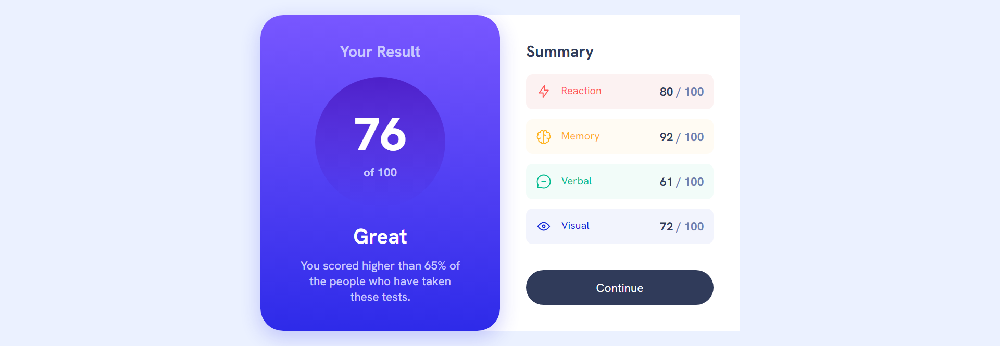

# Results summary component solution

## Table of contents

- [Overview](#overview)
  - [Screenshot](#screenshot)
  - [Project Links](#links)
  - [Built with](#built-with)
  - [Contact Me](#author)

## Overview

This project is a results summary component like the one you'd find in websites where you take quizzes and get the result afterwards.
more of a general component, can be adapted and changed easily to fit in any website that'd need it.

### Screenshot

### Links

- Solution URL: [Solution](https://www.frontendmentor.io/solutions/results-summary-component-yin3jhlmMk)
- Live Site URL: [Live site](https://safensound95.github.io/results-summary-component/)

### Built with

- HTML5
- CSS3
- Flexbox
- CSS Grid
- Mobile-first workflow

### Author

- Frontend Mentor : [@SafeNSound95](https://www.frontendmentor.io/profile/SafeNSound95)
